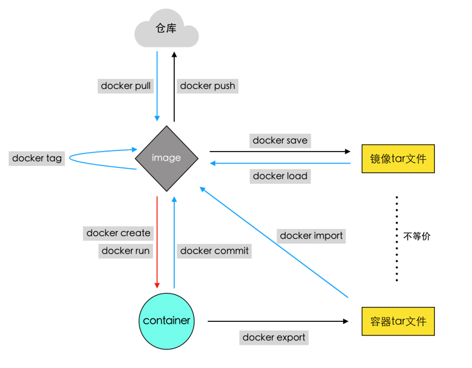

# Docker的容器与镜像

|command|description|sample|
|-|-|-|
|`docker commit`|根据容器生成一个新的镜像|`docker commit [OPTIONS] CONTAINER [REPOSITORY[:TAG]]`|
|`docker export`|`将容器当前的文件系统导出成一个tar文件`|`docker export [OPTIONS] CONTAINER`|
|`docker import`|从一个tar文件中导入内容创建一个镜像|`docker import [OPTIONS] file\|URL\|- [REPOSITORY[:TAG]]`|
