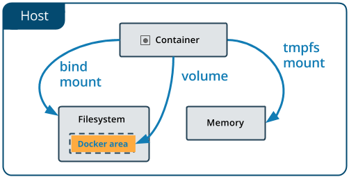

# Docker 数据卷管理

## Docker挂载容器数据卷的三种方式



- bind mounts：将宿主机上的一个文件或目录被挂载到容器上。
- volumes：由Docker创建和管理。使用docker volume命令管理
- tmpfs mounts：tmpfs 是一种基于内存的临时文件系统。tmpfs mounts 数据不会存储在磁盘上。

## bind mounts方式挂载数据卷

利用docker run/create的参数为容器挂载数据卷

用法：

- 方式一：
  - -v, --volume参数
  - -v 宿主机文件或文件夹路径:容器中的文件或者文件夹路径
- 方式二：
  - --mount参数
  - --mount type=bind, src=宿主机文件或文件夹路径, dst=容器中的文件或者文件夹路径

注意：src指定的文件和路径必须提前创建或存在

## volumes方式挂载数据卷

利用docker run/create为容器挂载数据卷

用法：

- 方式一:
  -v, --volume参数
  -v VOLUME-NAME:容器中的文件或者文件夹路径
- 方式二:
  --mount 参数
  --mount type=volume, src=VOLUME-NAME, dst=容器中的文件或者文件夹路径

volume对象管理：

```bash
docker volume 命令管理volume数据卷对象
docker volume create  创建数据卷对象
docker volume inspect 查看数据卷详细信息
docker volume ls      查看已创建的数据卷对象
docker volume prune   删除未被使用的数据卷对象
docker volume rm      删除一个或多个数据卷对象
```

## tmpfs mount方式挂载数据卷

利用docker run/create为容器挂载数据卷
用法：`--mount type=tmpfs, dst=PATH`

## 共享其他容器的数据卷-数据卷容器

利用docker run/create 的--volumes-from参数指定数据卷容器
用法：`docker run/create --volumes-from CONTAINER`
