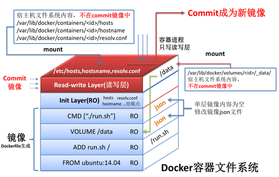

# Dockerfile 特征

查看[官方的Dockerfile](https://github.com/docker-library/docs)

- Dockerfile必须具备一个FROM命令来进行构建
- 每一个Dockerfile命令都会构建一层镜像（本质上是每一层都会启动一个容器，执行完命令后，将容器进行提交后，产生新的镜像层）
- 通过查看下载下来的镜像，发现历史层信息的层ID是missing，其实是因为原本的层id只存在于构建镜像的宿主机上，一旦转移镜像后，历史层消息中将只保留最新一层的ID
