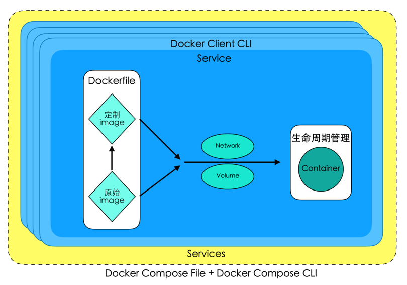

# Docker Compose 简介

- Docker Compose是一个能一次性定义和管理多个Docker容器的工具。
- 详细地说：
  - Compose中定义和启动的每一个容器都相当于一个服务(service)
  - Compose中能定义和启动多个服务，且它们之间通常具有协同关系
管理方式：
- 使用YAML文件来配置我们应用程序的服务。
  - 使用单个命令（docker-compose up），就可以创建并启动配置文件中配置的所有服务。

## 安装

Docker for Mac与Docker for Windows自带docker-compose
Linux下需要单独安装：
第一步：
`sudo curl -L https://github.com/docker/compose/releases/download/1.21.2/docker-compose-$(uname -s)-$(uname -m) -o /usr/local/bin/docker-compose`

第二步：
`sudo chmod +x /usr/local/bin/docker-compose`
终端中使用docker-compose --version查看安装的版本
这里示例安装版本是1.21.2，很可能您看到这里时，已经出现更新的版本，因此建议换成最新版本。[查看最新版本](https://github.com/docker/compose/releases)。

[其他安装方法查看](https://docs.docker.com/compose/install/#install-compose)

## Docker Compose CLI 
- 利用docker-compose --help查看或者[查看官方文档](https://docs.docker.com/compose/reference/overview/)
- 对比后会发现：Docker Compose CLI的很多命令的功能和Docker Client CLI是相似的。最主要的区别就是前者能一次性运行管理多个容器，后者只能一次管理一个。

