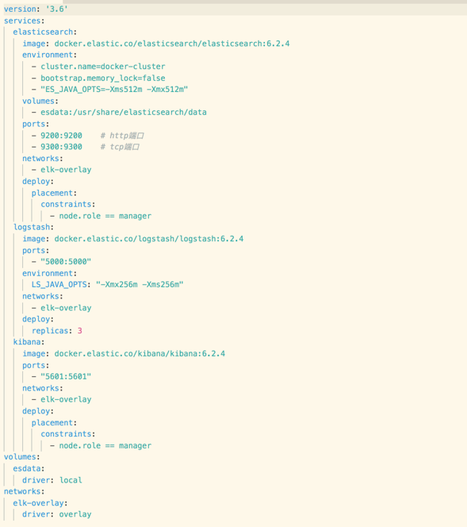

# 了解 Docker Compose File

## Docker Compose File版本

- [Docker Compose File](https://docs.docker.com/compose/compose-file/) 有多个版本，基本是向后兼容的，但也有极个别配置项高版本中没有。
- 在docker-compose.yml一开始就需要利用version关键词标明当前file使用的版本

## Docker Compose File TOP配置参数概览

Docker Compose File 顶级配置项：

- version：指定Docker Compose File版本号
- services：定义多个服务并配置启动参数
- volumes：声明或创建在多个服务中共同使用的数据卷对象
- networks：定义在多个服务中共同使用的网络对象
- configs：声明将在本服务中要使用的一些配置文件
- secrets：声明将在本服务中要使用的一些秘钥、密码文件
- x-***：自定义配置。主要用于复用相同的配置。

[更多详细配置](https://docs.docker.com/compose/compose-file/#service-configuration-reference)

## Docker Compose File 参考示例

