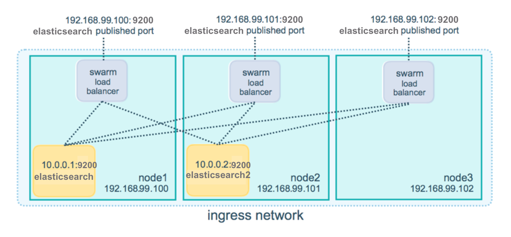
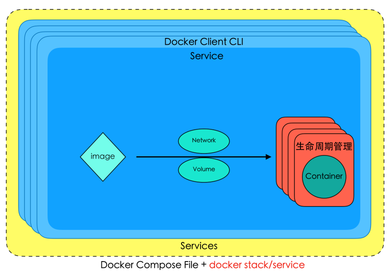

# 案例三.多主机环境ELK系统搭建

## Swarm

## 集群版Docker Compose工作原理

## 步骤

- 使用[docker swarm](https://docs.docker.com/engine/reference/commandline/swarm/)配置多个docker node集群节点
- 配置集群版ELK的docker-compose.yaml文件
- 利用docker stack deploy部署集群版ELK环境
